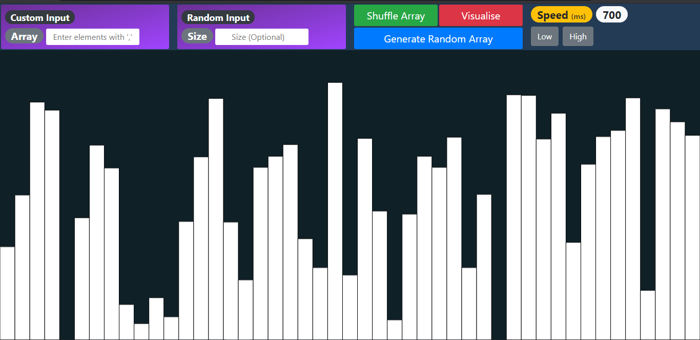
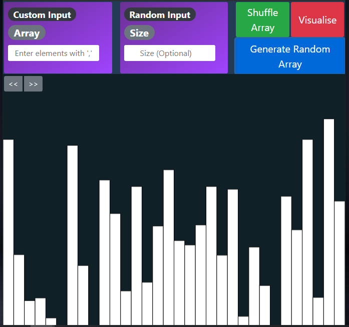
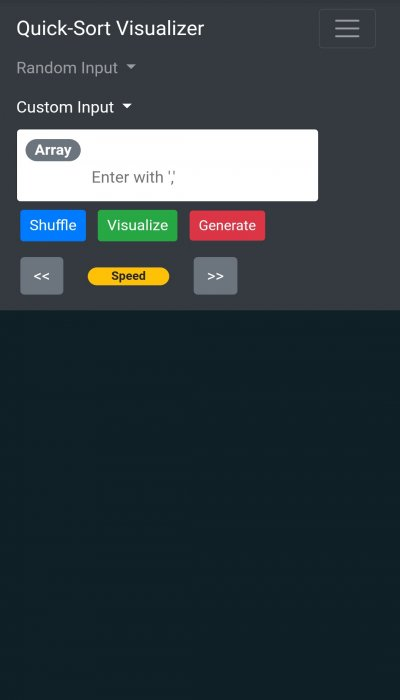
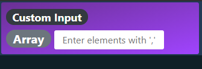
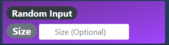
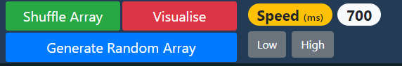
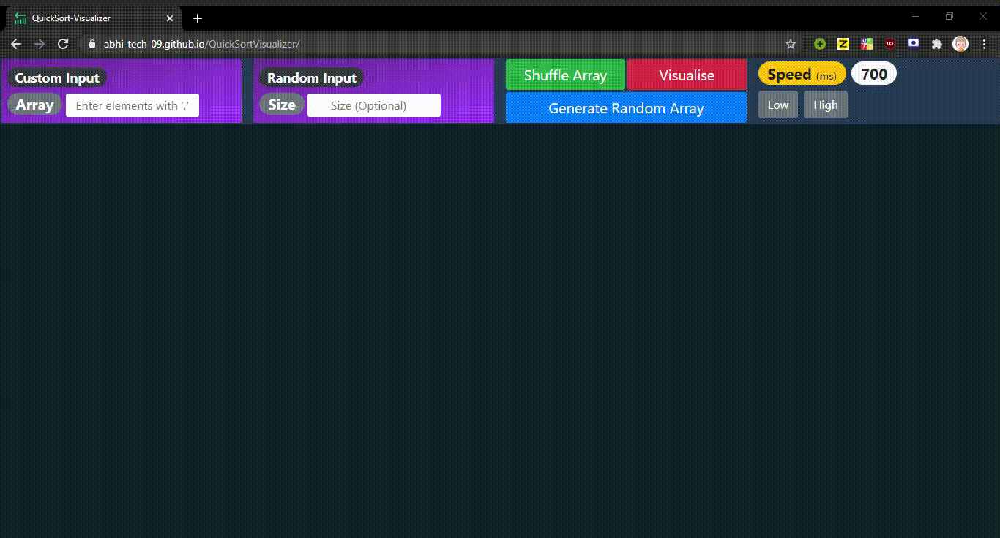

<h1 align="center">
    <strong>QuickSort Visualizer</strong>
     
</h1>

## Hello Everyone!

Welcome, to our QuickSort Visualizer.
When we first encountered sorting Algorithms, QuickSort was the first Algo that really fascinated us. But the flow behind the scenes was difficult to visualize since QuickSort uses recursive approach to implement Divide and conquer Technique.
  

So here is our project [QuickSort Visualizer](https://affectionate-agnesi-d5bbc9.netlify.app/) which is a visual representation of how QuickSort Algorithm works behind the scenes.

 

# _**Tech Used**_
* HTML5
* CSS3
* Bootstrap
* p5 JavaScript

 

# _**Website Demo**_

## *Landing Page*

* ### Desktop View 

* ### Tablet View

* ### Mobile View

## *Custom Inupt*

Here you can provide your custom array. The format for input is elements with **","** in between. Example : 53,20,11,9.

## *Random Input*

This is an optional field to generate an array with size specified here , and then filled with random elements.

## *Functionalities*

* ### Generate Random Array

     If size of array is specified in Random input section, then it generates array of that size .

     Otherwise, It will generate an array of random size filled with random values .

* ### Shuffle Array

     Shuffles the elements within the array which is displayed on screen.
* ### Visualize

    This is the button(backbone) of the visualizer tool, when clicked visualization get started .
* ### Speed

    To control the speed of the visualization , **low** implies decreament in spped and **high** implies increment in speed .
 

# _**Visualizing**_

			
**Blue color** indicates the elements in comparision.

**Red Color**  indicates the pivot element.

**Green Color** indicates the element is in sorted positon. 

# _**References**_

* For Quick-Sort Algorithm : [QuickSort Algorithm](https://www.geeksforgeeks.org/quick-sort/)
* For learning P5.js : [p5.js Tutorial](https://www.youtube.com/watch?v=HerCR8bw_GE&list=PLRqwX-V7Uu6Zy51Q-x9tMWIv9cueOFTFA)

 

# _**Contributors**_
<h4> <strong>

* [Abhishek Sharma](https://github.com/Abhi-tech-09)
    * [LinkedIn](https://www.google.com)
* [Saket Thota](https://github.com/SaketThota)
    * [LinkedIn](https://www.linkedin.com/in/saket-thota-163227192)

</strong> 
